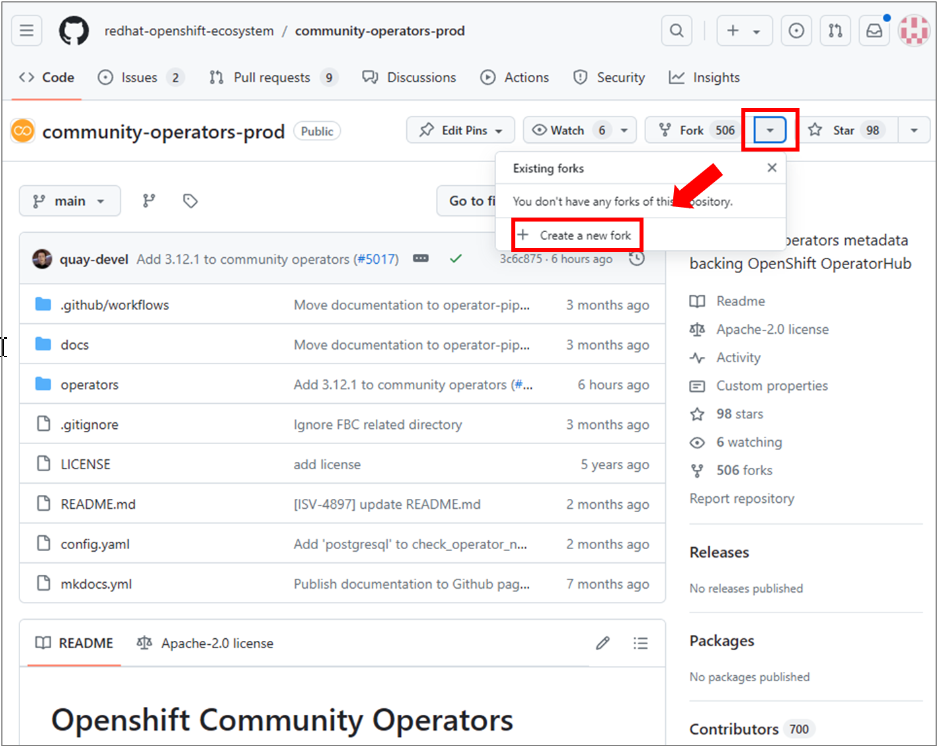
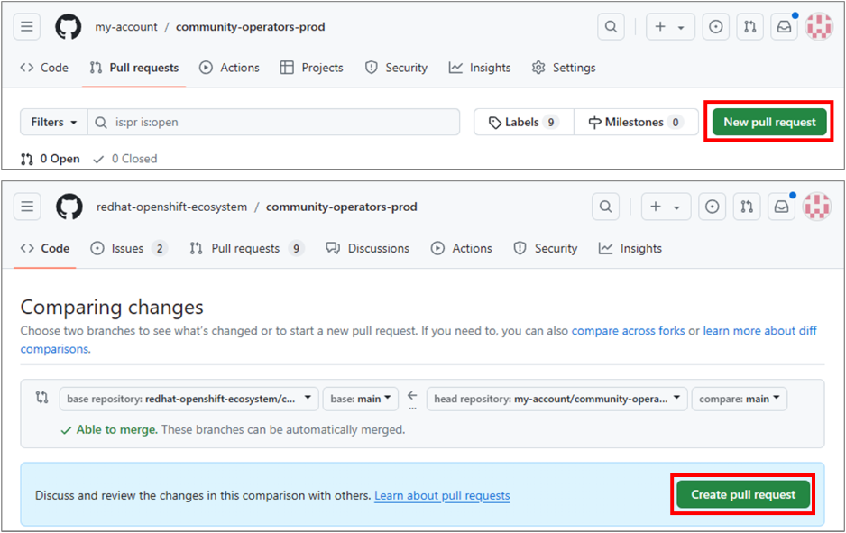
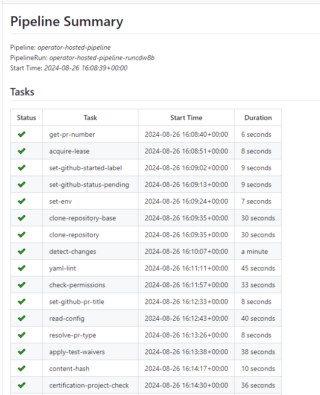
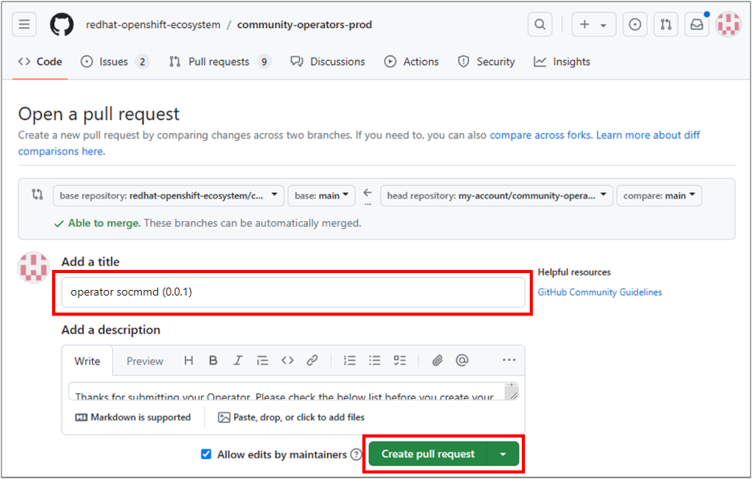
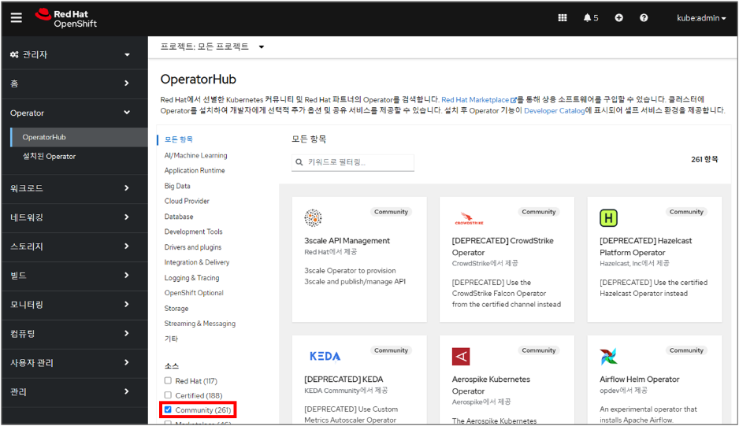

# How to Build and Deploy the Samsung Operator for CMM-D
This section explains how to build and deploy the Samsung Operator for CMM-D to the OLM's Community catalog, allowing users to conveniently access and utilize it through the OLM Web Console.   
<br>

## Build and Deploy
<br>

### Operator Build and Push
To build and push the operator, run the following command:   


```bash
$> make docker-build docker-push IMG=<registry>/<user>/<image_name>:<tag>
```   
<br>

### Bundle
- In order to use the Operator in the OLM environment, it's necessary to not only build the Operator image but also create it in a Bundle format.
- The Bundle consists of both Manifests and Metadata required for operator installation.
- If you merge the created bundle into the catalog source Git Repository of the Red Hat OpenShift Ecosystem, it will be automatically reflected in the list of Community catalog source operators in OperatorHub.   


> Generate Manifest   
> 
> ```bash
> $> make bundle
> $> tree bundle
> bundle
> ├── manifests
> │   ├── cmmd.samsung.com_cmmds.yaml
> │   ├── socmmd.clusterserviceversion.yaml
> │   └── ... 
> ├── metadata
> │   └── annotations.yaml
> └── tests
>     └── ...
> ```

<br>

### Fork Git Repository
Fork the [__community-operators-prod.git__](https://github.com/redhat-openshift-ecosystem/community-operators-prod.git) repository from the Red Hat OpenShift Ecosystem's GitHub Repository.   
<br>
   
   
<br>

```bash
$> tree
community-operators-prod
├── docs
│   └── ...
└── operators
     ├── some-other-operator
     │   ├── 0.0.1
     │   └── ...
     ├── ...

```   
<br>
Copy the bundle to the path Operator/<Operator name>/<version>.   

```bash	
$> tree
community-operators-prod

├── docs
│   └── ...
└── operators
     ├── socmmd
     │   └── 0.0.1
     │        ├── manifests
     │        │   ├── cmmd.samsung.com_cmmds.yaml
     │        │   ├── socmmd.clusterserviceversion.yaml
     │        │   └── ... 
     │        ├── metadata
     │        │   └── annotations.yaml
     │        └── tests
     │             └── ...
     ├── some-other-operator
     │   ├── 0.0.1
     │   └── ...
     ├── ...

```   

<br>

### Merge


1. Create a Pull Request in your forked repository to propose merging the changes into the original repository.

   

<br>

> - After you create a Pull Request, the Red Hat Operator Community will review and verify the Bundle that has been submitted.   
>    

<br><br>   
2. The title should be formatted as follows: Operator<operator name>(<versionA>)   

   

<br><br>

3. Once the Pull Request is created and validated, and the merge is completed, it will be reflected in the list of Community catalog source operators on OperatorHub after a certain period of time.  

   

