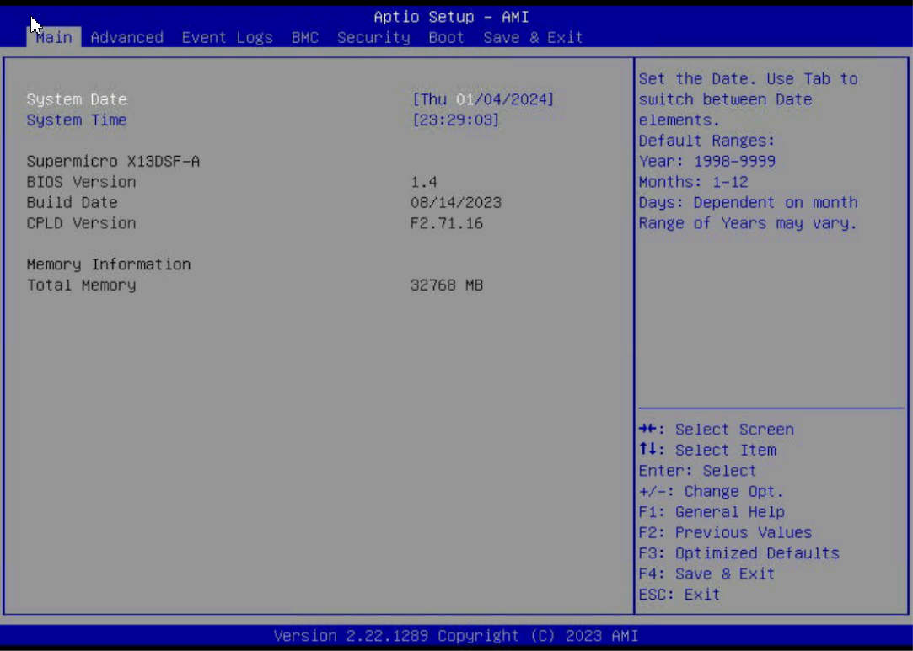
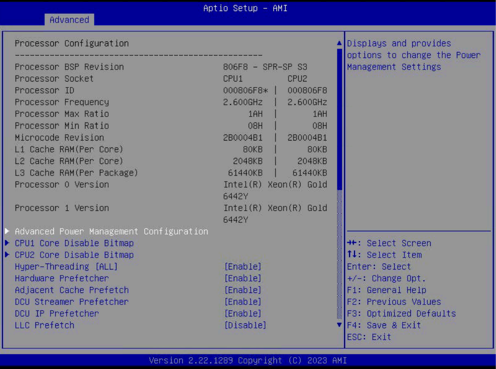
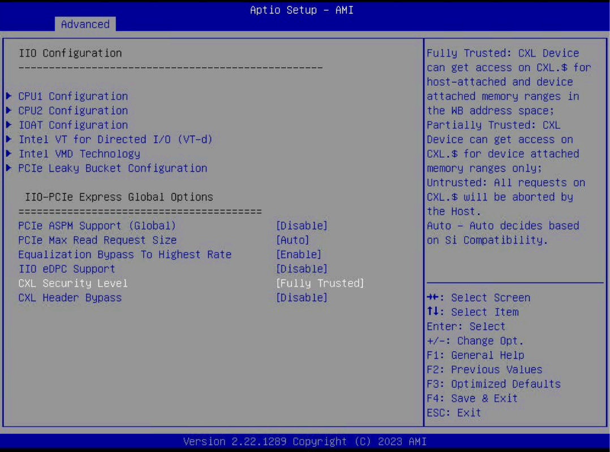
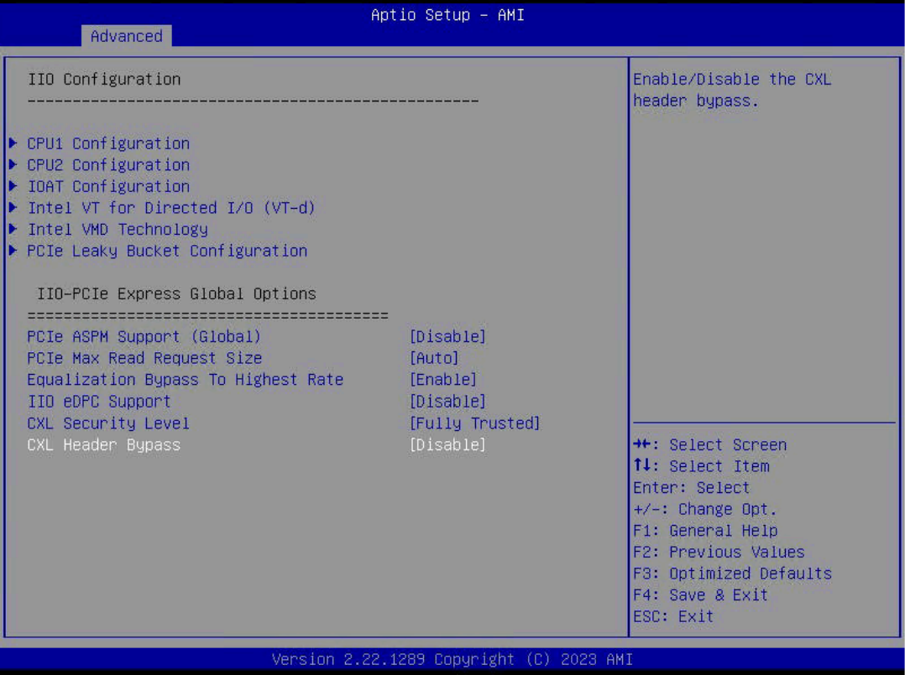
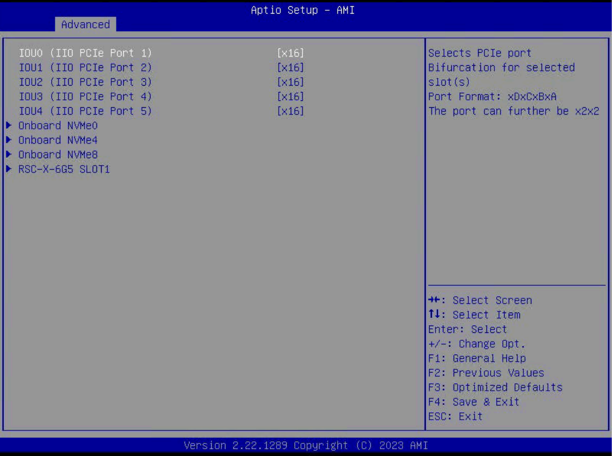
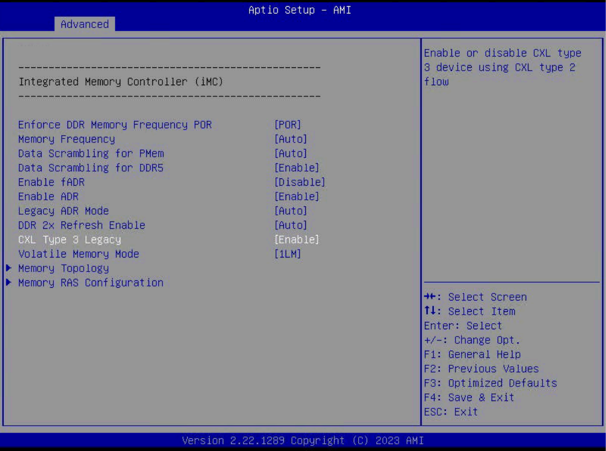
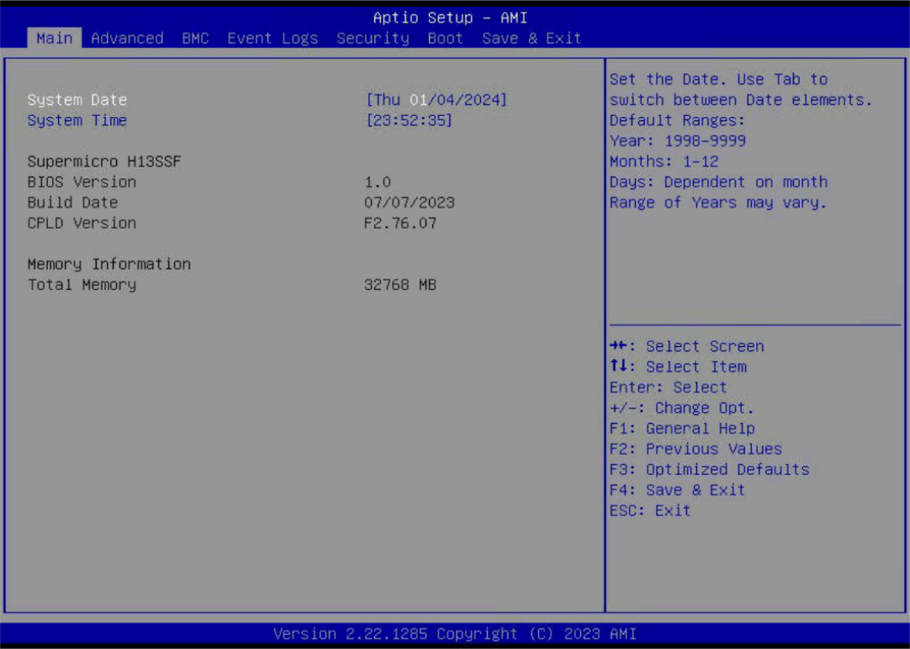
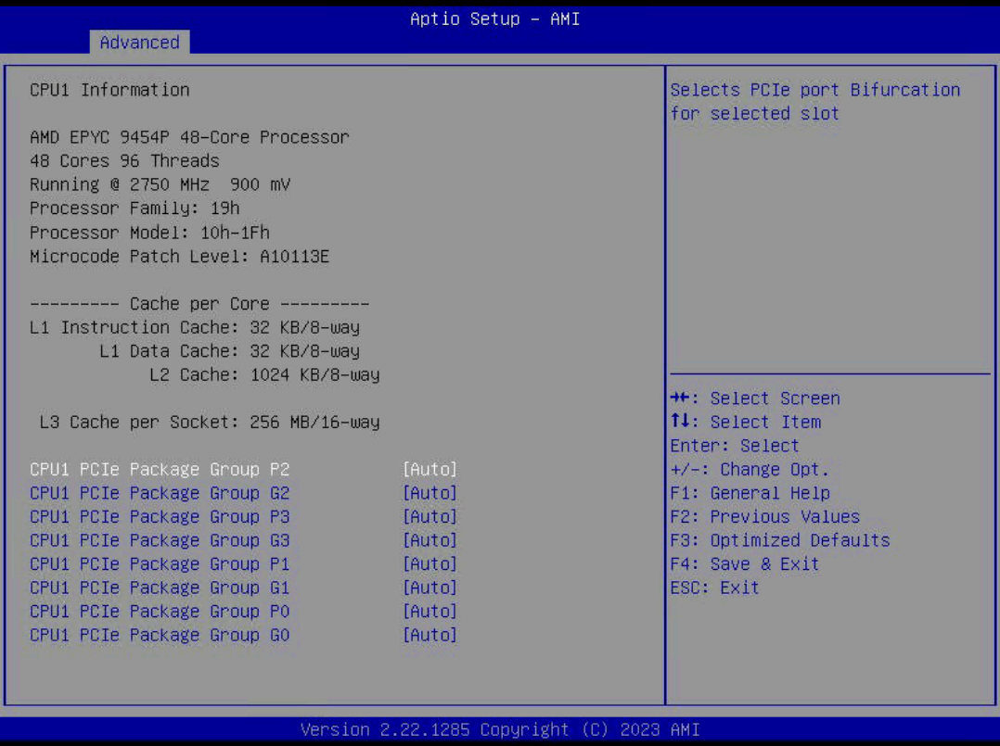

# System requirments
This document describes the system and BIOS requirements for the stable use of the Samsung CMM-D Operator.   
It has been tested and verified on Supermicro servers that currently support CXL Extend Memory.  
   

The following tables show the Baremetal Hosts, x86 CPUs, BIOS versions, and OS (Linux) versions currently supporting Samsung CMM-D. Additionally, it describes the BIOS configurations for AMD and Intel x86 CPUs.

### Supported baremetal Host Information
|TYPE|OS Ver|Server Model|BIOS rev|CPU|Memory|Disk|
|-----|----------|-----|-----|---------|----------|-----------|
|AMD|RHEL 9.3|Supermicro Super Server   ( Base Board : H13SSF )|07/07/2023|48 core   1 Socket|32 GB   (1 NUMA)|894.3 GB|
|INTEL|RHEL 9.3|Supermicro   SSG-121E-NE316R   ( Base Board : X13DSF-A )|08/14/2023|24 core   1 Socket|32 GB   (1 NUMA)|894.3 GB|

<br>   

### CPU Model Information
| TYPE 	| CPU Model 	| OEM Strings 	|
|---	|---	|---	|
| AMD 	| AMD EPYC 9454P 48-Core Processor 	| AMD EPYC Soc/Genoa Supermicro Motherboard-H13 Series 	|
| INTEL 	| Intel(R) Xeon(R) Gold 6442Y 	| Intel Sapphire Rapids/Emmitsburg/EagleStream Supermicro motherboard-X13   Series 	|   
   
<br>   

### Samsung CXL Expander Information
| TYPE 	| CXL Expander Model 	|
|---	|---	|
| AMD 	| CXL: Montage Technology Co., Ltd. Device c000 |
| INTEL 	| CXL: Montage Technology Co., Ltd. Device c000&nbsp;&nbsp;&nbsp;&nbsp;&nbsp;&nbsp;&nbsp;&nbsp;&nbsp;&nbsp;&nbsp;&nbsp;&nbsp;&nbsp;&nbsp;&nbsp;&nbsp;&nbsp;&nbsp;&nbsp;&nbsp;&nbsp;&nbsp;&nbsp;&nbsp;&nbsp;&nbsp;&nbsp;&nbsp;&nbsp;&nbsp;&nbsp;&nbsp;&nbsp;&nbsp;&nbsp;&nbsp;&nbsp;&nbsp;&nbsp;&nbsp;&nbsp;&nbsp;&nbsp;&nbsp;&nbsp;&nbsp;&nbsp;&nbsp;&nbsp;&nbsp;&nbsp;&nbsp;&nbsp;&nbsp;&nbsp;&nbsp;&nbsp;&nbsp;&nbsp;&nbsp;&nbsp;&nbsp;&nbsp;&nbsp;&nbsp;&nbsp;&nbsp;&nbsp;&nbsp;&nbsp;&nbsp;&nbsp;&nbsp;&nbsp;&nbsp;&nbsp;&nbsp;&nbsp;&nbsp;&nbsp;&nbsp;&nbsp;&nbsp;&nbsp;&nbsp;&nbsp;&nbsp;&nbsp;&nbsp;&nbsp;&nbsp;&nbsp;&nbsp;&nbsp;&nbsp;&nbsp;&nbsp;&nbsp;&nbsp;|   

<br>   

### CXL Operating System (Linux) Compatibility
Samsung CXL Expander (1.1) Memory can be recognized in both Intel and AMD CPU environments, and it is important to verify whether the OS kernel supports CXL.   
Please check this in advance. Below is the OS support table for verification. 
<table>
        <tr>
            <th scope="col">TYPE</th>
            <th scope="col">BIOS Mode</th>
            <th scope="col">Linux Version</th>
        </tr>
        <tr>
            <td rowspan="4">AMD</td>
            <td rowspan="2">SPM Disable <br> (System RAM Type)</td>
            <td>Red Hat Enterprise Linux 9.2  or later<br>( Kernel : 5.14.0-284 )</td>
        </tr>
        <tr>
            <td>* Memory recognition in most <b>operating systems</b>, including <b>Fedora 37, 38</b>, and others.</td>
        </tr>
        <tr>
            <td rowspan="2">SPM Disable <br> ((DAX HotPlug Type)</td>
            <td>Red Hat Enterprise Linux 9.2 or later<br>( Kernel : 5.14.0-284 )</td>
        </tr>
        <tr>
            <td>Fedora 37 or later<br>( Kernel : kernel-6.5.8-100 )</td>
        </tr>
        <tr>
            <td rowspan="3">INTEL</td>
            <td>SPM Disable <br> (System RAM Type)</td>
            <td style="color:red"><b>BIOS NOT Support</b></td>
        </tr>
        <tr>
            <td rowspan="2">SPM Disable <br> ((DAX HotPlug Type)</td>
            <td>Red Hat Enterprise Linux 9.2 or later<br>( Kernel : 5.14.0-284 )</td>
        </tr>
        <tr>
            <td>Fedora 37 or later<br>( Kernel : kernel-6.5.8-100 )</td>
        </tr>        
</table>
<br>

## INTEL BIOS Version rquierment
For Intel CPU architectures that support CXL Memory Expander, the following environments must be met:   
```yaml
➔ Vendor : American Megatrends International, LLC.
➔ System Product Name : SSG-121E-NE316R
➔ Board Product Name : X13DSF-A (1.01)
➔ BIOS Version : 1.4 ( Revision : 5.31 )
➔ Build Date : 08/14/2023
➔ CPLD Version : F2.71.16 
```

For Intel BIOS that supports CXL Memory Expander, the capacity of the CXL Memory Expander may or may not be listed under Total Memory.   
In the BIOS environment described in the current usage guide, the CXL Memory Expander capacity is not listed separately; only the local memory capacity is shown.   


   
<br>

### INTEL CPU Information
INTEL Sapphire Rapids CPUs provide an enhanced I/O environment with PCIe 5.0 and CXL (Compute Express Link) 1.1 interconnects.   

```yaml
➔ CPU Model Name : Intel(R) Xeon(R) Gold 6442Y
➔ ( INTEL Sapphire Rapids/Emmitsburg/EagleStream )
➔ Supermicro motherboard-X13 Series
```
   


<br>

### INTEL BIOS Configueration
Set the security level for the CXL device to 'Fully Trusted'.   
<b>➔ Advanced Menu ➔ Chipset Configuration ➔ North Bridge ➔ IIO Configuration ➔    
CXL Security Level :<span style='background-color: yellow; color: red;'>[ Fully Trusted ]</span></b>
<br>


<br>

Disable CXL Header Bypass.   
   
<b>➔ Advanced Menu ➔ Chipset Configuration ➔ North Bridge ➔ IIO Configuration ➔    
CXL Header bypass :<span style='background-color: yellow; color: red;'>[ Disable ]</span></b>
<br>


<br>

Configure the branch settings of the PCIe port for CPU0.   
   
<b>➔ Advanced Menu ➔ Chipset Configuration ➔ North Bridge ➔ IIO Configuration ➔    
CPU0 Configuration ➔ IOU3 (IIO PCIe Port 3) : <span style='background-color: yellow; color: red;'>[ x16 ]</span></b>
<br>


<br>

Configure the branch settings of the PCIe port for CPU1.   
   
<b>➔ Advanced Menu ➔ Chipset Configuration ➔ North Bridge ➔ IIO Configuration ➔    
CPU0 Configuration ➔ IOU3 (IIO PCIe Port 3) : <span style='background-color: yellow; color: red;'>[ x16 ]</span></b>
<br>


<br>

Enable legacy support for CXL Type 3 devices.  
   
<b>➔ Advanced Menu ➔ NB Configuration ➔ Memory Configuration ➔ CXL Type3 legacy : <span style='background-color: yellow; color: red;'>[ Enable ]</span></b>
<br>


<br>

Proceed with setting up the CXL EFI_MEMORY_SP. <b>( Default : Enabled )</b>   
```yaml
➔ This setting designates CXL memory as special-purpose memory. For Intel architecture, only the 'Enabled' option is available.
➔ Enabled : DAX Mode 사용
➔ Disabled: Use Direct System Memory (Intel cannot be used - MB function is not provided). 
```
   
<br>

## AMD BIOS Version rquierment
For AMD architectures that support Samsung CMM-D, the following environments must be met:   
```yaml
➔ Vendor : American Megatrends International, LLC.
➔ System Product Name : Super Server
➔ Board Product Name : H13SSF (1.01)
➔ BIOS Version : 1.0
➔ BIOS Revision : 5.27
➔ Build Date : 07/07/2023
➔ CPLD Version : F2.76.07 
```

For AMD BIOS that supports CXL Memory Expander, the capacity of the CXL Memory Expander may or may not be listed under Total Memory.   
In the BIOS environment described in the current usage guide, the CXL Memory Expander capacity is not listed separately; only the local memory capacity is shown.   


   
<br>

### AMD CPU Information
AMD EPYC Genoa CPUs provide an enhanced I/O environment with PCIe 5.0 and CXL (Compute Express Link) 1.1 interconnects.   

```yaml
➔ CPU Model Name : AMD EPYC 9454P 48-Core Processor
( AMD EPYC Soc/Genoa )
➔ Supermicro Motherboard-H13 Series  
```
   

   
<br>

### AMD CXL SPM Mode
This setting designates CXL memory as special-purpose memory. The differences between activation and deactivation are as follows:   
   
<b>➔ Advanced Menu ➔ NB Configuration ➔ CXL SPM : <span style='background-color: yellow; color: red;'>[ Enabled ]</span></b>   
<b>➔ Enabled : Use DAX Mode (to be used after activating the CXL Expander at the OS level, based on the intended purpose).</b>   
<b>➔ Disabled : Use Direct System Memory (activate the CXL Expander at the BIOS level beforehand and use it after recognizing the local memory in the OS).</b>   
<br>   
   

