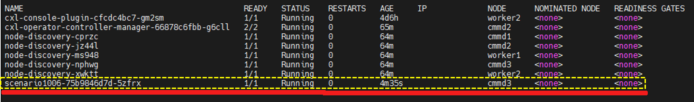

# Samsung Operator for CMM-D Test Environment
<br>

## Hardware Configuration
|Node|H/W|Usage|CPU|Local Memory|CXL|etc|
|-----|----------|-----|-----|---------|----------|-----------|
|node #1|Dell|KVM|Intel <br> 96 Core|512 GB|NA|&nbsp;&nbsp;&nbsp;&nbsp;&nbsp;&nbsp;&nbsp;&nbsp;&nbsp;&nbsp;|
|node #2 / <br> cmmd1|SMC|OCP Worker #1|Intel <br> 96 Core|64 GB|512 GB <br> 128 GB * 4ea|&nbsp;&nbsp;&nbsp;&nbsp;&nbsp;&nbsp;&nbsp;&nbsp;&nbsp;&nbsp;|
 node #3 / <br> cmmd2|SMC|OCP Worker #2|AMD <br> 96 Core|128 GB|512 GB <br> 128 GB * 4ea|&nbsp;&nbsp;&nbsp;&nbsp;&nbsp;&nbsp;&nbsp;&nbsp;&nbsp;&nbsp;|
 node #4 / <br> cmmd3|SMC|OCP Worker #3|AMD <br> 96 Core|64 GB|512 GB <br> 128 GB * 4ea|&nbsp;&nbsp;&nbsp;&nbsp;&nbsp;&nbsp;&nbsp;&nbsp;&nbsp;&nbsp;|
   
<br>   

## Software Configuration
 Software version information is as follows:

```bash
$ oc version
Client Version: 4.14.16
Kustomize Version: v5.0.1
Server Version: 4.14.16
Kubernetes Version: v1.27.10+c79e5e2

$ oc debug node/cmmd1
sh-4.4# chroot /host
sh-5.1# grep -e "OPENSHIFT_VERSION" -e "RHEL_VERSION" -e "^VERSION=" /etc/os-release
VERSION="414.92.202403051622-0"
OPENSHIFT_VERSION="4.14"
RHEL_VERSION="9.2"
```
<br>
   

## Test Scenario Target Node Information
 Information about the target node for the End-to-End (E2E) test scenario is as follows:   


 <br>


## How to Test Operator Functions
This is an explanation of how to use the Samsung Operator for CMM-D.  
<br>
   
1. Openshift Cluster Installation
- To test the CMM-D Operator, an OpenShift Cluster must be installed in a server environment where CMM-D is configured, as described in the hardware and software environment above.
  For detailed installation instructions, please refer to the [Red Hat OpenShift installation guide](https://docs.redhat.com/ko/documentation/openshift_container_platform/4.9/html-single/installing/index).
  
2. Installing the Operator via the OCP Web Console   <br><br>
	1) Search for Operators    <br>  
	   The image below shows the first screen when accessing the Red Hat OCP Web Console.   

	      
	   <br>

	   The image below shows the screen that appears when you click the OperatorHub menu to search for an operator in the Red Hat OCP Web Console.   

	      
	   <br>

	   The image below shows the search screen for finding the Samsung Operator for CMM-D. When you enter a search term, the matching operators will be displayed.   

	      
	   <br>

	2) Select the Operator and Specify Installation Options   
	
	   The image below shows the installation screen that appears when you click on the operator found in step 1.
           After selecting the necessary installation options, click the 'Install' button to proceed.   

	      
	   <br>

	4) Operator Installation   
	
	   The image below shows the installation screen that appears when you click the 'Install' button, as shown in the previous image.   <br>

	      
	   <br>

	   The image below shows the screen displayed after the operator installation is completed.   

	      
	   <br><br>   

3. CRD (Custom Resource Definition)   
		- CRD is defined as follows. Based on this definition, submit a Custom Resource (CR).
		   
```yaml
apiVersion: apiextensions.k8s.io/v1					<1>
kind: CustomResourceDefinition						<2>   
metadata:
  annotations:
    controller-gen.kubebuilder.io/version: v0.11.1
  name: cmmds.cmmd.samsung.com
spec:
  group: cmmd.samsung.com
  names:
    kind: CMMD
    listKind: CMMDList
    plural: cmmds
    singular: cmmd
  scope: Namespaced
  versions:											<3>
  - name: v1										<4>
    schema:											<5>
    openAPIV3Schema:
      description: CMMD is the Schema for the cmmds API
      properties:
        apiVersion:        
          type: string
        kind:          
          type: string
        metadata:
          type: object

```		

   <b>&#10102; <span style="color:blue">&nbsp;&nbsp;&nbsp;&nbsp;&nbsp;&nbsp;&nbsp;Define the API version</span></b><br>
   <b>&#10103; <span style="color:blue">&nbsp;&nbsp;&nbsp;&nbsp;&nbsp;&nbsp;&nbsp;Defines the type of YAML document, specified as a Custom Resource Definition (CRD) document.</span></b><br>
   <b>&#10104;<span style="color:blue">&nbsp;&nbsp;&nbsp;&nbsp;&nbsp;&nbsp;&nbsp;&nbsp;Defines the list of versions supported by the CRD.</span></b><br>
   <b>&#10105; <span style="color:blue">&nbsp;&nbsp;&nbsp;&nbsp;&nbsp;&nbsp;&nbsp;Defines the name of the corresponding CRD version.</span></b><br>
   <b>&#10106;<span style="color:blue">&nbsp;&nbsp;&nbsp;&nbsp;&nbsp;&nbsp;&nbsp;&nbsp;Define the resource schema</span></b><br>
<br>   
   

```yaml
          spec:					<1>
            description: CMMDSpec defines the desired state of CMMD
            properties:			<2>
              allocate:			<3>
                description: Specify resource allocation manually
                properties:
                  cpu:			<4>                    
                    type: string
                  memory:		<5>                    
                    type: string
                  nodeName:		<6>
                    type: string
                type: object
              allocateMode:		<7>
                description: Specify resource allocation mode
                enum:
                - auto
                - manual
                type: string
              enable:			<8>
                description: Whether use of CMMD
                type: boolean
              payload:			<9>
                description: Specify user resource manifest. e.g.) Pod, Deployment,
                  Replicaset
                type: object
                x-kubernetes-embedded-resource: true
                x-kubernetes-preserve-unknown-fields: true
            required:			<10>
            - allocateMode
            - enable
            - payload
            type: object

```		

   <b>&#10102;<span style="color:blue">&nbsp;&nbsp;&nbsp;&nbsp;&nbsp;&nbsp;&nbsp;&nbsp;Define the specifications for the desired CMMD</span></b><br>
   <b>&#10103;<span style="color:blue">&nbsp;&nbsp;&nbsp;&nbsp;&nbsp;&nbsp;&nbsp;&nbsp;Define the properties of the specification</span></b><br>
   <b>&#10104;<span style="color:blue">&nbsp;&nbsp;&nbsp;&nbsp;&nbsp;&nbsp;&nbsp;&nbsp;Defines properties for manually assigning resource allocations, including CPU, Memory, and nodeName.</span></b><br>
   <b>&#10105;<span style="color:blue">&nbsp;&nbsp;&nbsp;&nbsp;&nbsp;&nbsp;&nbsp;&nbsp;Specifies CPU resource allocation as a string type.</span></b><br>
   <b>&#10106;<span style="color:blue">&nbsp;&nbsp;&nbsp;&nbsp;&nbsp;&nbsp;&nbsp;&nbsp;Specifies resource allocation for memory as a string type using numbers.</span></b><br>
   <b>&#10107;<span style="color:blue">&nbsp;&nbsp;&nbsp;&nbsp;&nbsp;&nbsp;&nbsp;&nbsp;Specify the name of the node to which resources will be allocated, in string format.</span></b><br>
   <b>&#10108;<span style="color:blue">&nbsp;&nbsp;&nbsp;&nbsp;&nbsp;&nbsp;&nbsp;&nbsp;Specify the resource allocation mode as either auto (automatic resource allocation) or manual (manual resource allocation).</span></b><br>
   <b>&#10109;<span style="color:blue">&nbsp;&nbsp;&nbsp;&nbsp;&nbsp;&nbsp;&nbsp;&nbsp;Defines whether to use CMMD.</span></b><br>
   <b>&#10110;<span style="color:blue">&nbsp;&nbsp;&nbsp;&nbsp;&nbsp;&nbsp;&nbsp;&nbsp;Specifies the manifest for the Custom Resource (CR).</span></b><br>
   <b>&#10111;<span style="color:blue">&nbsp;&nbsp;&nbsp;&nbsp;&nbsp;&nbsp;&nbsp;&nbsp;Lists the required fields among the Spec properties. Here, allocateMode, enable, and payload are mandatory.</span></b><br>     	
<br>   


## E2E Test
Prepare the environment for the E2E Test as described above. 
>- Build an environment that meets the specified hardware and software requirements.   
>- Openshift Cluster Installation   
>- Installing the Operator through the Web Console.   
>- Analysis of CRD (Custom Resource Definition)
<br>

After preparation, proceed with the test as follows.

<br>
   

### Test Scenario #1
By specifying CPU and Memory NUMA in __Manual mode__ on nodes (cmmd1, cmmd2, cmmd3) in the Samsung environment with CMM-D configured, test whether the designated CPU and memory are utilized correctly.
  
<br>    

> 1. Execution Details   

- Target Node : cmmd1 (intel cpu node)
- allocationMode : manual
- memory : 2 (CMMD Numa)
- cpu : 0-23 (cpu 0)
- Resource Quota : 100 GB
- Resource Reclamation through Pod Creation and Deletion   
<br>

> 2. CR (Custom Resource)   

```yaml
apiVersion: cmmd.samsung.com/v1
kind: CMMD
metadata:
  name: scenario1001
  namespace: socmmd-system
spec:
  allocateMode: manual      <1>
  allocate:
    cpu: "0-23"             <2>
    memory: "2"             <3>
    nodeName: "cmmd1"       <4>
  enable: true              <5>
  payload:
    apiVersion: v1
    kind: Pod
    metadata:
      namespace: socmmd-system
      name: scenario1001
      labels:
        name: senario
    spec:
      terminationGracePeriodSeconds: 0
      containers:
      - name: stress
        image: quay.io/alicek106/stress:latest
        args: ["tail", "-f", "/dev/null"]
        resources:          <6>
          requests:
            memory: 100Gi
          limits:
            memory: 100Gi

```
   
   <b>&#10102;<span style="color:blue">&nbsp;&nbsp;&nbsp;&nbsp;&nbsp;&nbsp;&nbsp;&nbsp;This is a technical description of the resource allocation modes(Manual: A mode for explicitly allocating resources by specifying them., Auto: A mode for automatically allocating resources by selecting the most efficient node.)</span></b><br>
   <b>&#10103;<span style="color:blue">&nbsp;&nbsp;&nbsp;&nbsp;&nbsp;&nbsp;&nbsp;&nbsp;Definition of CPU Cores when in Manual Mode</span></b><br>
   <b>&#10104;<span style="color:blue">&nbsp;&nbsp;&nbsp;&nbsp;&nbsp;&nbsp;&nbsp;&nbsp;Definition of Memory NUMA when in Manual Mode</span></b><br>
   <b>&#10105;<span style="color:blue">&nbsp;&nbsp;&nbsp;&nbsp;&nbsp;&nbsp;&nbsp;&nbsp;Define the target node name for the Pod to be created</span></b><br>
   <b>&#10106;<span style="color:blue">&nbsp;&nbsp;&nbsp;&nbsp;&nbsp;&nbsp;&nbsp;&nbsp;Whether to utilize the CMMD device (true: use, false: do not use)</span></b><br>
   <b>&#10107;<span style="color:blue">&nbsp;&nbsp;&nbsp;&nbsp;&nbsp;&nbsp;&nbsp;&nbsp;Describes the requested/limited resources.</span></b><br>
<br>   

> 3. Submit the Custom Resource (Create Pod)   
>      
>   
> 4. Check the Created Pod   
> 
> ```bash
> [kni@bastion work]$ oc get pod
> ```  
>         

  >> Check the stress load on the allocated memory resources
  >>    
  >> 
  >> Check the stress load on the allocated memory resources
  >>    
  >> 
  >> Check the stress load on the assigned cpu resources
  >>    
<br>   


> 5. Delete the Created Pod   
>   
>      
<br>   

> 6. Check Deleted Pods   
>   
>      
<br>   
   
   <br>
   <br>


### Test Senario #2
If you submit a request for generating a 200GB pod in Auto mode with 400GB pod assigned to the cmmd2 node among the nodes (cmmd1, cmmd2, cmmd3) in a Samsung environment with CMM-D set, test whether the pod is automatically generated in the node with the least press among the three nodes
  
<br>    

> 1. Pre-Setting Details   

- Target Node : cmmd2
- Create Permission : Proceed with Creating the ServiceAccount and Assigning Permissions
- Resource Quota : Allocate a 400 GB Pod to the CMM-D on the cmmd2 node
<br>

> 2. Execution Details   

- Target Node : All nodes (cmmd1, cmmd2, cmmd3)
- allocationMode : auto
- Resource Quota : 200 GB
- Resource Reclamation through Pod Creation and Deletion   
<br>

> 3. Create ServiceAccount and permissions   

```yaml
---
apiVersion: rbac.authorization.k8s.io/v1
kind: ClusterRole
metadata:
  labels:
    app.kubernetes.io/component: stress01
    app.kubernetes.io/managed-by: cluster-monitoring-operator
    app.kubernetes.io/name: stress01
    app.kubernetes.io/part-of: stress01
  name: stress01
rules:
- apiGroups:
  - events.k8s.io
  - ""
  resources:
  - events
  verbs:
  - get
  - list
  - watch
  - create
  - update
- apiGroups:
  - operators.coreos.com
  resources:
  - clusterserviceversions
  - operators
  verbs:
  - get
  - list
  - watch
- apiGroups:
  - machineconfiguration.openshift.io
  resources:
  - machineconfigs
  verbs:
  - get
  - list
  - watch
- apiGroups:
  - security.openshift.io
  resources:
  - securitycontextconstraints
  verbs:
  - use
---
apiVersion: rbac.authorization.k8s.io/v1
kind: ClusterRoleBinding
metadata:
  labels:
    app: node-discovery
  name: stress01
roleRef:
  apiGroup: rbac.authorization.k8s.io
  kind: ClusterRole
  name: stress01
subjects:
- kind: ServiceAccount
  name: stress01
  namespace: socmmd-system
---
apiVersion: v1
kind: ServiceAccount
metadata:
  labels:
    app.kubernetes.io/component: stress01
    app.kubernetes.io/managed-by: cluster-monitoring-operator
    app.kubernetes.io/name: stress01
    app.kubernetes.io/part-of: stress01
  name: stress01
  namespace: socmmd-system

```   
<br>


> 4. Pre-allocated Custom Resource (CR) for the cmmd2 server   

```yaml
apiVersion: cmmd.samsung.com/v1
kind: CMMD
metadata:
  name: scenario-common
  namespace: socmmd-system
spec:
  allocateMode: manual              <1>
  allocate:
    nodeName: cmmd2                 <2>
    cpu: "auto"                     <3>  
    memory: "1"                     <4>
  enable: true
  payload:
    apiVersion: apps/v1
    kind: Deployment
    metadata:
      name: scenario-common
      namespace: socmmd-system
    spec:
      replicas: 1
      selector:
        matchLabels:
          name: scenario-common
      template:
        metadata: 
          labels:
            name: scenario-common
        spec:
          terminationGracePeriodSeconds: 0
          nodeSelector:
            node-role.kubernetes.io/cmmd: ""
          containers:
          - name: stress01
            image: quay.io/alicek106/stress:latest
            args: ["tail", "-f", "/dev/null"]
            resources:                <5>
              requests:
                memory: 400Gi     
              limits:
                memory: 400Gi     
          serviceAccount: stress01
          serviceAccountName: stress01


```
   
   <b>&#10102;<span style="color:blue">&nbsp;&nbsp;&nbsp;&nbsp;&nbsp;&nbsp;&nbsp;&nbsp;This is a technical description of the resource allocation modes(Manual: A mode for explicitly allocating resources by specifying them., Auto: A mode for automatically allocating resources by selecting the most efficient node.)</span></b><br>
   <b>&#10103;<span style="color:blue">&nbsp;&nbsp;&nbsp;&nbsp;&nbsp;&nbsp;&nbsp;&nbsp;Define the destination node name of the Pod to be created</span></b><br>
   <b>&#10104;<span style="color:blue">&nbsp;&nbsp;&nbsp;&nbsp;&nbsp;&nbsp;&nbsp;&nbsp;Define CPU Core to be specified in manual mode (automatic assignment)</span></b><br>
   <b>&#10105;<span style="color:blue">&nbsp;&nbsp;&nbsp;&nbsp;&nbsp;&nbsp;&nbsp;&nbsp;Define Memory NUMA to be specified in manual mode</span></b><br>
   <b>&#10106;<span style="color:blue">&nbsp;&nbsp;&nbsp;&nbsp;&nbsp;&nbsp;&nbsp;&nbsp;Describes the resource information to request and limit</span></b><br>
<br>   

> 5. Test CR (Custom Resource)   

```yaml
apiVersion: cmmd.samsung.com/v1
kind: CMMD
metadata:
  name: scenario1003
  namespace: socmmd-system
spec:
  allocateMode: auto                  <1>
  enable: true                        <2>  
  payload:
    apiVersion: apps/v1
    kind: Deployment
    metadata:
      name: scenario1003
      namespace: socmmd-system
    spec:
      replicas: 1
      selector:
        matchLabels:
          name: scenario1003
      template:
        metadata: 
          labels:
            name: scenario1003
        spec:
          terminationGracePeriodSeconds: 0
          nodeSelector:
            node-role.kubernetes.io/cmmd: ""
          containers:
          - name: stress01
            image: quay.io/alicek106/stress:latest
            args: ["tail", "-f", "/dev/null"]
            resources:
              requests:
                memory: 200Gi
              limits:
                memory: 200Gi
          serviceAccount: stress01
          serviceAccountName: stress01

```
   
   <b>&#10102;<span style="color:blue">&nbsp;&nbsp;&nbsp;&nbsp;&nbsp;&nbsp;&nbsp;&nbsp;This is a technical description of the resource allocation modes(Manual: A mode for explicitly allocating resources by specifying them., Auto: A mode for automatically allocating resources by selecting the most efficient node.)</span></b><br>
   <b>&#10103;<span style="color:blue">&nbsp;&nbsp;&nbsp;&nbsp;&nbsp;&nbsp;&nbsp;&nbsp;Whether to utilize the CMMD device (true: use, false: do not use)</span></b><br>
<br>   


> 6. Submit the Custom Resource (Create Pod)   
>> Before Scenario Create pod
>> ```bash
>> [kni@bastion work]$ oc apply -f pre-app.yaml pod
>> ```
>>    
>> Scenario Create pod 
>> ```bash
>> [kni@bastion work]$ oc apply -f my-app.yaml pod
>> ```
>
> 7. Check Create pod (Before, Test)    
> 
> ```bash
> [kni@bastion work]$ oc get pod
> ```  
>         
>  <b>&#10102;&nbsp;&nbsp;&nbsp;&nbsp;&nbsp;&nbsp;&nbsp;&nbsp;Pre-generated pods for testing</b><br>
>  <b>&#10103;&nbsp;&nbsp;&nbsp;&nbsp;&nbsp;&nbsp;&nbsp;&nbsp;Test generated above Pod</b><br>

><br>   

> 5. Delete created pods   
>   
> ```bash
> [kni@bastion work]$ oc delete -f pre-app.yaml pod
> ```   
>   

> 6. Check Deleted Pod   
>   
>      

<br>
<br>
### Test Scenario #3
Test that 50GB of Pod is created in the node with the least press value of each node's local memory, without using CMM-D device resources for nodes (cmmd1, cmmd2, cmmd3) in an environment where CMM-D is set   

<br>    
   
> 1. Execution Details   

- Target Node : All nodes (cmmd1, cmmd2, cmmd3)
- allocationMode : auto
- enable : false
- Resource Quota : 50 GB

<br>

> 2. CR (Custom Resource)   

```yaml
apiVersion: cmmd.samsung.com/v1
kind: CMMD
metadata:
  name: scenario1006
  namespace: socmmd-system
spec:
  allocateMode: auto              <1>
  enable: false                   <2>
  payload:
    apiVersion: apps/v1
    kind: Deployment
    metadata:
      name: scenario1006
      namespace: socmmd-system
    spec:
      replicas: 1
      selector:
        matchLabels:
          name: scenario1006
      template:
        metadata: 
          labels:
            name: scenario1006
        spec:
          terminationGracePeriodSeconds: 0
          nodeSelector:
            node-role.kubernetes.io/cmmd: ""
          containers:
          - name: stress01
            image: quay.io/alicek106/stress:latest
            args: ["tail", "-f", "/dev/null"]
            resources:
              requests:
                memory: 50Gi
              limits:
                memory: 50Gi
          serviceAccount: stress01
          serviceAccountName: stress01

```
   
   <b>&#10102;<span style="color:blue">&nbsp;&nbsp;&nbsp;&nbsp;&nbsp;&nbsp;&nbsp;&nbsp;This is a technical description of the resource allocation modes(Manual: A mode for explicitly allocating resources by specifying them., Auto: A mode for automatically allocating resources by selecting the most efficient node.)</span></b><br>
   <b>&#10103;<span style="color:blue">&nbsp;&nbsp;&nbsp;&nbsp;&nbsp;&nbsp;&nbsp;&nbsp;Whether to utilize the CMMD device (true: use, false: do not use)</span></b><br>
<br>   

> 3. Submit the Custom Resource (Create Pod)   
> ```bash
> [kni@bastion work]$ oc apply -f my-app.yaml pod
> ``` 
>   
> 4. Check the Created Pod  
> 
> ```bash
> [kni@bastion work]$ oc get pod
> ```  
>         
