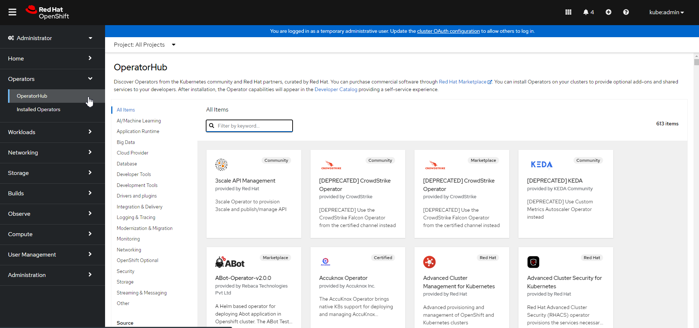
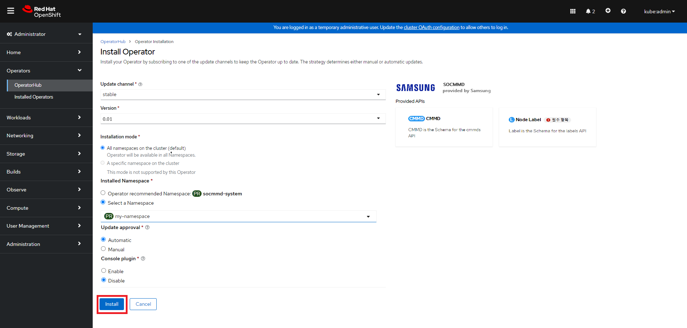
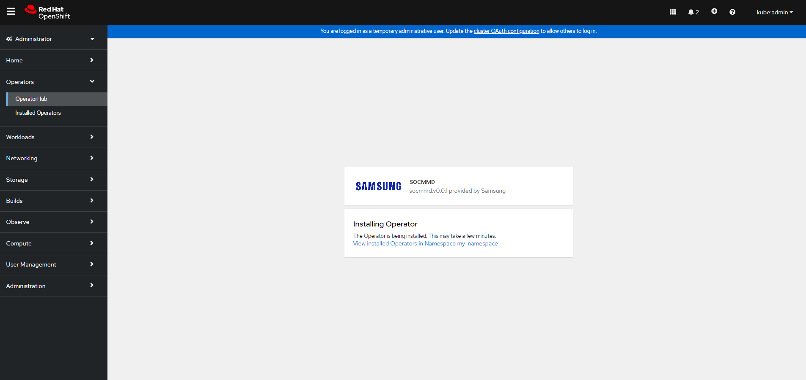

# Quick User Guide for Samsung Operator for CMM-D
This guide provides a quick overview of configuring the hardware and software environment to use the Samsung Operator for CMM-D, as well as instructions for installing and using the Operator. For detailed hardware specifications and BIOS settings, please refer to the [__System Requirements__](./CXL_requiements.md) document.

<br>

## Hardware Configuration
|Node|H/W|Usage|CPU|Local Memory|CXL|etc|
|-----|----------|-----|-----|---------|----------|-----------|
|node #1|Dell|KVM|Intel <br> 96 Core|512 GB|NA|&nbsp;&nbsp;&nbsp;&nbsp;&nbsp;&nbsp;&nbsp;&nbsp;&nbsp;&nbsp;|
|node #2|SMC|OCP Worker #1|Intel <br> 96 Core|64 GB|512 GB <br> 128 GB * 4ea|&nbsp;&nbsp;&nbsp;&nbsp;&nbsp;&nbsp;&nbsp;&nbsp;&nbsp;&nbsp;|
 node #3|SMC|OCP Worker #2|AMD <br> 96 Core|128 GB|512 GB <br> 128 GB * 4ea|&nbsp;&nbsp;&nbsp;&nbsp;&nbsp;&nbsp;&nbsp;&nbsp;&nbsp;&nbsp;|
 node #4|SMC|OCP Worker #3|AMD <br> 96 Core|64 GB|512 GB <br> 128 GB * 4ea|&nbsp;&nbsp;&nbsp;&nbsp;&nbsp;&nbsp;&nbsp;&nbsp;&nbsp;&nbsp;|
   
<br>   

## Software Configuration
Software version information is as follows:

```bash
$ oc version
Client Version: 4.14.16
Kustomize Version: v5.0.1
Server Version: 4.14.16
Kubernetes Version: v1.27.10+c79e5e2

$ oc debug node/cmmd1
sh-4.4# chroot /host
sh-5.1# grep -e "OPENSHIFT_VERSION" -e "RHEL_VERSION" -e "^VERSION=" /etc/os-release
VERSION="414.92.202403051622-0"
OPENSHIFT_VERSION="4.14"
RHEL_VERSION="9.2"
```
<br>
   

## How to Install and Use the Operator
This is an explanation of how to use the Samsung Operator for CMM-D.  
<br>
   
1. OpenShift Cluster Installation
- To test the CMM-D Operator, an OpenShift Cluster must be installed in a server environment with CMM-D configured, as described in the hardware and software environment above.
  For detailed installation instructions, please refer to the [__Red Hat OpenShift installation documentation__](https://docs.redhat.com/ko/documentation/openshift_container_platform/4.9/html-single/installing/index).
  
2. Operator Installation via Red Hat OCP Web Console   <br><br>
	1) Search for Operators in the Red Hat OCP Web Console   <br>  
	   The image below shows the first screen when accessing the Red Hat OCP Web Console.   

	      
	   <br>

	   The image below shows the screen that appears when you click the OperatorHub menu to search for an operator in the Red Hat OCP Web Console.   

	      
	   <br>

	   The image below shows the search screen for finding the Samsung Operator for CMM-D.
           Enter a search term to find relevant operators.   

	      
	   <br>

	3) Select the Operator and Specify Installation Options   
	
	   The image below shows the installation screen that appears when you click on the operator found in step 1). After selecting the necessary installation options, click the 'Install' button to proceed.   

	      
	   <br>

	4) Operator Installation   
	
	   The image below shows the installation screen that appears when you click the 'Install' button in the previous image.   <br>

	      
	   <br>

	   The image below shows the screen displayed upon completion of the operator installation.   

	      
	   <br><br>   

3. Samsung Operator for CMM-D Usage Examples   
The following explains the Custom Resource Definition (CRD) required for using Samsung Operator for CMM-D, how to submit a Custom Resource (CR) based on the CRD, and how to check and delete Pods created through the CR, illustrated with two examples.

	1) CRD (Custom Resource Definition)   
		- CRD (Custom Resource Definition) is essential for creating a Pod through an Operator. This is explained below.
		   
```yaml
apiVersion: apiextensions.k8s.io/v1       <1>
kind: CustomResourceDefinition            <2>   
metadata:
  annotations:
    controller-gen.kubebuilder.io/version: v0.11.1
  name: cmmds.cmmd.samsung.com
spec:
  group: cmmd.samsung.com
  names:
    kind: CMMD
    listKind: CMMDList
    plural: cmmds
    singular: cmmd
  scope: Namespaced
  versions:                               <3>
  - name: v1                              <4>
    schema:                               <5>
    openAPIV3Schema:
      description: CMMD is the Schema for the cmmds API
      properties:
        apiVersion:          
          type: string
        kind:          
          type: string
        metadata:
          type: object

```		
 
   <b>&#10102; <span style="color:blue">&nbsp;&nbsp;&nbsp;&nbsp;&nbsp;&nbsp;&nbsp;&nbsp;Define the API version</span></b><br>
   <b>&#10103; <span style="color:blue">&nbsp;&nbsp;&nbsp;&nbsp;&nbsp;&nbsp;&nbsp;&nbsp;Defines the type of YAML document, specified as a Custom Resource Definition (CRD) document.</span></b><br>
   <b>&#10104;<span style="color:blue">&nbsp;&nbsp;&nbsp;&nbsp;&nbsp;&nbsp;&nbsp;&nbsp;Defines the list of versions supported by the CRD.</span></b><br>
   <b>&#10105; <span style="color:blue">&nbsp;&nbsp;&nbsp;&nbsp;&nbsp;&nbsp;&nbsp;&nbsp;Defines the name of the corresponding CRD version.</span></b><br>
   <b>&#10106;<span style="color:blue">&nbsp;&nbsp;&nbsp;&nbsp;&nbsp;&nbsp;&nbsp;&nbsp;Define the resource schema</span></b><br>
<br>   
   

```yaml
          spec:					<1>
            description: CMMDSpec defines the desired state of CMMD
            properties:			<2>
              allocate:			<3>
                description: Specify resource allocation manually
                properties:
                  cpu:			<4>                    
                    type: string
                  memory:		<5>
                    type: string
                  nodeName:		<6>
                    type: string
                type: object
              allocateMode:		<7>
                description: Specify resource allocation mode
                enum:
                - auto
                - manual
                type: string
              enable:			<8>
                description: Whether use of CMMD
                type: boolean
              payload:			<9>
                description: Specify user resource manifest. e.g.) Pod, Deployment,
                  Replicaset
                type: object
                x-kubernetes-embedded-resource: true
                x-kubernetes-preserve-unknown-fields: true
            required:			<10>
            - allocateMode
            - enable
            - payload
            type: object

```		

   <b>&#10102;<span style="color:blue">&nbsp;&nbsp;&nbsp;&nbsp;&nbsp;&nbsp;&nbsp;&nbsp;Define the specifications for the desired CMMD</span></b><br>
   <b>&#10103;<span style="color:blue">&nbsp;&nbsp;&nbsp;&nbsp;&nbsp;&nbsp;&nbsp;&nbsp;Define the properties of the specification</span></b><br>
   <b>&#10104;<span style="color:blue">&nbsp;&nbsp;&nbsp;&nbsp;&nbsp;&nbsp;&nbsp;&nbsp;Defines properties for manually assigning resource allocations, including CPU, Memory, and nodeName.</span></b><br>
   <b>&#10105;<span style="color:blue">&nbsp;&nbsp;&nbsp;&nbsp;&nbsp;&nbsp;&nbsp;&nbsp;Specifies CPU resource allocation as a string type. (Set the cpuset.cpu value.)</span></b><br>
   <b>&#10106;<span style="color:blue">&nbsp;&nbsp;&nbsp;&nbsp;&nbsp;&nbsp;&nbsp;&nbsp;Specifies resource allocation for memory as a string type using numbers. (Set the cpuset.mems value.)</span></b><br>
   <b>&#10107;<span style="color:blue">&nbsp;&nbsp;&nbsp;&nbsp;&nbsp;&nbsp;&nbsp;&nbsp;Specify the name of the node to which resources will be allocated, in string format.</span></b><br>
   <b>&#10108;<span style="color:blue">&nbsp;&nbsp;&nbsp;&nbsp;&nbsp;&nbsp;&nbsp;&nbsp;Specify the resource allocation mode as either auto (automatic resource allocation) or manual (manual resource allocation).</span></b><br>
   <b>&#10109;<span style="color:blue">&nbsp;&nbsp;&nbsp;&nbsp;&nbsp;&nbsp;&nbsp;&nbsp;Defines whether to use CMMD.</span></b><br>
   <b>&#10110;<span style="color:blue">&nbsp;&nbsp;&nbsp;&nbsp;&nbsp;&nbsp;&nbsp;&nbsp;Specifies the manifest for the Custom Resource (CR).</span></b><br>
   <b>&#10111;<span style="color:blue">&nbsp;&nbsp;&nbsp;&nbsp;&nbsp;&nbsp;&nbsp;&nbsp;Lists the required fields among the Spec properties. Here, allocateMode, enable, and payload are mandatory.</span></b><br>   	
<br>   

2) Submit a Custom Resource (CR) Sample 1 - Manual mode   
 	- This is an example of how a user manually specifies and submits the properties defined by the Custom Resource (CR).   
   
<br>

> A. Custom Resource (CR) Submission Scenario   

- By specifying CPU and Memory NUMA in __Manual mode__ on nodes (cmmd1, cmmd2, cmmd3) in the Samsung environment with CMM-D configured, test whether the designated CPU and memory are utilized correctly.   
<br>		

> B. Execution Details   

- Target Node : cmmd1 (intel cpu node)
- allocationMode : manual
- memory : 2 (CMMD Numa)
- cpu : 0-23 (cpu 0)
- Resource Quota : 100 GB
- Resource Reclamation through Pod Creation and Deletion   
<br>

> C. CR (Custom Resource)   

```yaml
apiVersion: cmmd.samsung.com/v1
kind: CMMD
metadata:
  name: my-app
  namespace: work
spec:
  allocateMode: manual					<1>
  allocate:
    cpu: "0-23"							<2>
    memory: "2"							<3>
    nodeName: "cmmd1"					<4>
  enable: true							<5>
  payload:
    apiVersion: v1
    kind: Pod
    metadata:
      name: my-app
    spec:
      terminationGracePeriodSeconds: 0
      containers:
      - name: stress
        image: <stress image>
        args: ["tail", "-f", "/dev/null"]
        resources:						<6>
          requests:
            memory: 100Gi
          limits:
            memory: 100Gi

```
   
   <b>&#10102;<span style="color:blue">&nbsp;&nbsp;&nbsp;&nbsp;&nbsp;&nbsp;&nbsp;&nbsp;This is a technical description of the resource allocation modes(Manual: A mode for explicitly allocating resources by specifying them., Auto: A mode for automatically allocating resources by selecting the most efficient node.)</span></b><br>
   <b>&#10103;<span style="color:blue">&nbsp;&nbsp;&nbsp;&nbsp;&nbsp;&nbsp;&nbsp;&nbsp;Definition of CPU Cores when in Manual Mode</span></b><br>
   <b>&#10104;<span style="color:blue">&nbsp;&nbsp;&nbsp;&nbsp;&nbsp;&nbsp;&nbsp;&nbsp;Definition of Memory NUMA when in Manual Mode</span></b><br>
   <b>&#10105;<span style="color:blue">&nbsp;&nbsp;&nbsp;&nbsp;&nbsp;&nbsp;&nbsp;&nbsp;Define the target node name for the Pod to be created</span></b><br>
   <b>&#10106;<span style="color:blue">&nbsp;&nbsp;&nbsp;&nbsp;&nbsp;&nbsp;&nbsp;&nbsp;Whether to utilize the CMMD device (true: use, false: do not use)</span></b><br>
   <b>&#10107;<span style="color:blue">&nbsp;&nbsp;&nbsp;&nbsp;&nbsp;&nbsp;&nbsp;&nbsp;Describes the requested/limited resources.</span></b><br>
<br>   

> D. Submit the Custom Resource (Create Pod)   
   
      
<br>   

> E. Check the Created Pod   
   
      
<br>   

> F. Delete the Created Pod   
   
      
<br>   

> G. Check Deleted Pods   
   
      
<br>   


3)  Submit Custom Resource (CR) Sample 2 - Auto mode   
  - This is an example of how a user submits the properties specified by CR using the auto mode. The auto mode provides a scheduling function that automatically designates the most efficient node for the Pod to be created.   
   
<br>
> A. Custom Resource (CR) Submission Scenario   

- If you submit a request for generating a 200GB pod in Auto mode with 400GB pod assigned to the cmmd2 node among the nodes (cmmd1, cmmd2, cmmd3) in a Samsung environment with CMM-D set, test whether the pod is automatically generated in the node with the least press among the three nodes   
<br>		

> B. Pre-Setting Details   

- Target Node : cmmd2
- Create Permission : Proceed with Creating the ServiceAccount and Assigning Permissions
- Resource Quota : Allocate a 400 GB Pod to the CMM-D on the cmmd2 node
<br>

> C. Execution Details   

- Target Node : All nodes (cmmd1, cmmd2, cmmd3)
- allocationMode : auto
- Resource Quota : 200 GB
- Resource Reclamation through Pod Creation and Deletion  
<br>

> D. CR (Custom Resource)   

```yaml
apiVersion: cmmd.samsung.com/v1
kind: CMMD
metadata:
  name: my-app
  namespace: work
spec:
  allocateMode: auto					<1>
  enable: true							<2>
  payload:
    apiVersion: apps/v1
    kind: Deployment
    metadata:
      name: my-app
    spec:
      replicas: 1
      selector:
        matchLabels:
          name: my-app
      template:
        metadata: 
          labels:
            name: my-app
        spec:
          terminationGracePeriodSeconds: 0
          nodeSelector:
            node-role.kubernetes.io/cmmd: ""
          containers:
          - name: stress01
            image: <stress image>
            args: ["tail", "-f", "/dev/null"]
            resources:					
              requests:
                memory: 200Gi
              limits:
                memory: 200Gi
          serviceAccount: stress01
          serviceAccountName: stress01

```
   


   <b>&#10102;<span style="color:blue">&nbsp;&nbsp;&nbsp;&nbsp;&nbsp;&nbsp;&nbsp;&nbsp;This is a technical description of the resource allocation modes(Manual: A mode for explicitly allocating resources by specifying them., Auto: A mode for automatically allocating resources by selecting the most efficient node.)</span></b><br>
   <b>&#10103;<span style="color:blue">&nbsp;&nbsp;&nbsp;&nbsp;&nbsp;&nbsp;&nbsp;&nbsp;Whether to utilize the CMMD device (true: use, false: do not use)</span></b><br>

<br>   

> E. Submit the Custom Resource (Create Pod)   
   
      
<br>   

> F. Check the Created Pod   
   
      
<br>   

> G. Delete the Created Pod   
   
      
<br>   

> H. Check Deleted Pods  
   
      
<br>
